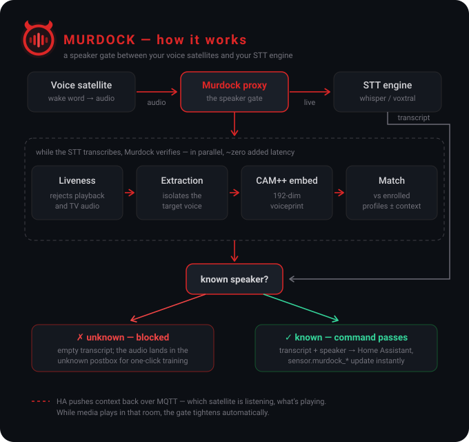

# Murdock v2

[](https://github.com/BobMcGlobus/Murdock/actions/workflows/ci.yml)
[](LICENSE)

Self-hosted **speaker-recognition Wyoming proxy** for Home Assistant. Sits
between a voice satellite (e.g. Home Assistant Voice PE) and a downstream
STT engine (faster-whisper, Parakeet, etc.) and acts as a *gatekeeper*:
it decides **who** is speaking, blocks unknown voices (including TV
audio), and injects speaker context back into Home Assistant so the
conversation agent knows whose command it's handling.

> Reference base: [jxlarrea/wyoming-voice-match](https://github.com/jxlarrea/wyoming-voice-match).
> Murdock replaces the ECAPA-TDNN embedder with WeSpeaker **CAM++ (ONNX)**,
> adds a **Web UI**, **sqlite-vec**-backed storage, **unknown-voice logging**,
> **liveness heuristics**, **sample quality scoring**, **voice clustering**,
> **adaptive speaker extraction**, **confidence calibration**, and
> **token-free MQTT integration** with Home Assistant.

## How it works

<p align="center">
  
</p>

Under the hood the verify path adds: sqlite-vec KNN over speaker
centroids, Platt-scaled confidence calibration, Silero VAD for
enrollment QC, per-satellite threshold overrides and media-aware gating
(see [Features](#features)).

**Known speaker** → audio is forwarded to upstream STT and the result is
published over MQTT (auto-discovered `sensor.murdock_*` entities) and/or
the legacy HA REST path (`input_text.current_speaker` + a
`speaker_recognition_detected` event).

**Unknown speaker** → empty transcript (command blocked). Audio is
optionally logged to an "enrollment postbox" with TTL so you can review,
cluster, and tag the sample later.

## Features

### Core recognition
- **Wyoming proxy** — registers as an ASR provider; HA auto-discovers it.
- **Pluggable STT backends** — Wyoming upstream (streaming,
  faster-whisper etc.), Voxtral (Mistral Cloud), or any
  **OpenAI-compatible** endpoint: OpenAI `gpt-4o-transcribe`, Groq
  `whisper-large-v3-turbo`, or a local OpenAI-compatible server
  (speaches). Optional **local Wyoming fallback** when the cloud backend
  fails, and an **A/B shadow engine** that transcribes every utterance
  with a second engine in the background — the shadow result is never
  returned to HA, it appears next to the primary transcript in the
  recognition log so two engines can be compared on real commands.
- **CAM++ ONNX** — 7 M params, 192-dim embeddings, <20 ms inference on
  CPU (no GPU needed).
- **sqlite-vec** — single-file database with SIMD-accelerated KNN.
- **Silero VAD** — rejects enrollment samples with too little speech.
- **Adaptive speaker extraction** — when an utterance contains more than
  one speech region (target + TV, or a second person), each region is
  embedded and scored, and only the dominant enrolled speaker's regions
  are kept before verification — so a background voice no longer drags
  the embedding into "unknown". A fast-path skips single-region clips
  entirely, so the common case adds only one cheap VAD pass.
- **Liveness heuristic** — spectral rolloff / crest factor / HF ratio
  label samples as "likely live" or "likely TV".
- **Early reject (opt-in)** — after ~1.5 s of clean voice, sessions
  catastrophically far from every profile (distance ≥ threshold +
  margin) are dropped: STT forwarding stops immediately and the
  satellite gets its empty transcript at stream end. Independent of the
  hard "require match" gate, so unknown humans can still pass while TV
  and radio get killed; media playing in the room (MQTT context) halves
  the margin. Rejected audio still lands in the unknown postbox for
  one-click training. Default off.
- **Auto-enroll with smart replacement** — high-confidence matches add
  fresh embeddings to the profile, replacing the lowest-quality sample
  when the cap is reached so the profile ages with the user's voice.

### Quality & tuning
- **Confidence calibration (Platt scaling)** — maps the raw cosine
  distance to a calibrated *probability that it's the same speaker*,
  fitted automatically from your enrolled samples (genuine =
  leave-one-out centroid distances, impostor = cross-speaker distances).
  The confidence reported to HA/MQTT becomes meaningful instead of a bare
  `1 - distance`. Refits in the background on enrollment changes; gating
  still uses the distance threshold. Groundwork for adaptive thresholds
  and context fusion.
- **Sample quality scoring** — composite 0–1 score from speech ratio,
  SNR, liveness, embedding consistency and centroid fit. Per-speaker
  "training quality" badge. Component weights are tunable from the UI.
- **Per-satellite thresholds** — override the verify threshold per
  satellite ID (e.g. a noisy kitchen vs. a quiet study) without
  touching the global default.
- **Per-satellite voice profiles** — an extra centroid per (speaker,
  satellite) built from same-mic samples; verification scores against
  the better of global/same-mic. Removes systematic microphone bias
  between satellites (fewer mics, no beamforming). Auto-maintained from
  satellite-tagged samples, including auto-enroll.
- **Adaptive per-speaker thresholds** — each speaker's gate derives from
  their own genuine/impostor score distributions (recomputed on every
  calibration refit), bounded to ±0.08 around the global threshold so a
  small enrollment can nudge but never fling the gate open. Per-satellite
  overrides keep applying as a delta on top.
- **Media-restriction matrix** — per (satellite × media source), set how
  much that source tightens the threshold while it's playing: the
  living-room TV restricts the living-room satellite strongly, a bedroom
  radio not at all. Fed by one HA automation that publishes every
  TV/radio/speaker's state; the strongest playing source wins. Sources
  with no explicit rule fall back to a default boost when they play in
  the satellite's room.
- **Voice-sample clustering** — greedy cosine clustering of untagged
  unknown samples, with bulk-assign so labelling the same voice five
  times is one click instead of five.

### UI & operations
- **Web UI** — speaker enrollment (browser mic or WAV/MP3/M4A/OGG/
  FLAC/WebM upload), sample review with playback, unknown-voice
  review, cluster review, recognition event log, runtime settings
  (collapsible sections).
- **Voice map** — 2-D PCA projection of the embedding space: every
  sample, each speaker's centroid, and the unknown samples on one
  scatter plot. Shows at a glance how cleanly speakers separate and
  which samples drift.
- **Speaker health** — per-sample drift from the centroid, age, and a
  quality trend (newest vs. oldest samples), with drifted samples
  flagged for pruning.
- **Satellite tagging** — samples remember which satellite recorded
  them, visible in the UI.
- **Backup/restore** — ZIP export of all speakers, samples and
  metadata; import with merge or replace mode.
- **DE / EN UI** — full translation for both locales.

### Home Assistant integration
- **MQTT auto-discovery (recommended)** — publishes recognition results
  over MQTT; entities (`sensor.murdock_current_speaker`,
  `binary_sensor.murdock_speaker_recognized`, confidence, distance,
  nearest speaker, role, emotion, satellite) appear automatically. **No
  token, no manual helpers.** In the add-on the broker is auto-wired from
  the Mosquitto service — zero config.
- **Context push (token-free)** — HA publishes TV state / presence onto
  retained `murdock/context/<room>/<key>` topics; Murdock subscribes and
  tightens its threshold while the TV is on. The data flow is inverted
  vs. the old REST path, so Murdock never needs a long-lived token.
- **REST + token (legacy)** — the original push-via-`input_text`/event
  path is still available for users who can't run a broker.
- **Speaker context delivery (selectable)** — how the recognised speaker
  reaches your conversation agent, as a mode dropdown. Either way the
  MQTT sensor entities keep publishing — the mode only changes the
  agent hand-off:
  - **Transcript untouched** (default) — speaker flows via the system
    prompt (reading the MQTT/REST sensors); HA's local intent matching
    keeps working.
  - **Transcript augmentation** — inject the recognition context
    (`{{ speaker }}`, `{{ role }}`, `{{ confidence }}`, `{{ nearest }}`, …)
    straight into the returned transcript via separate known/unknown
    templates, so it's fresh on every utterance with no system-prompt
    cache staleness. Trade-off: breaks HA's local intent matching, so
    it's for LLM-driven setups.

### Deployment
- **Home Assistant add-on** — one-click install from this repo as a
  custom repository; Web UI served through HA ingress (no port
  forwarding needed); MQTT broker auto-wired from Mosquitto.
- **docker-compose** — same image, standalone deployment.

## Quick start

### Option A — Home Assistant add-on (recommended for HA users)

1. **Settings → Add-ons → Add-on store → ⋮ → Repositories** and add
   this repository's URL.
2. Refresh, find **Murdock**, **Install**.
3. **Configuration** tab: set `upstream_uri` to your existing STT
   server (e.g. `tcp://core-whisper:10300` if faster-whisper runs on
   the same HA host).
4. Start the addon, click **Open Web UI**.

See [`DOCS.md`](DOCS.md) for details.

### Option B — docker-compose

```bash
# 1. Build
docker compose build

# 2. Start (upstream STT config is in docker-compose.yml)
docker compose up -d

# 3. Open the Web UI
open http://localhost:8099
```

All integration settings (MQTT broker, HA connection, entities) are
configured **in the Web UI** (Settings tab) — no `.env` file required.

### Home Assistant setup

1. **Voice → Devices & Services**: Home Assistant should auto-discover
   Murdock as a Wyoming ASR provider at `tcp://<host>:10350`.
2. **Assist Pipeline**: select `murdock-proxy` as the speech-to-text engine.
3. **Integration** — pick one:
   - **MQTT (recommended)**: enable it in **Web UI → MQTT**. In the
     add-on the broker is auto-wired from Mosquitto; standalone, enter
     your broker host/credentials. Entities appear automatically under a
     **Murdock** device — no helpers to create.
   - **REST (legacy)**: **Web UI → Home Assistant** tab, enter HA URL +
     long-lived token, then **Copy HA template** for a ready-made
     `configuration.yaml` snippet with all helper entities.
4. **Conversation agent**: add to `extra_system_prompt`:

   ```
   The current speaker is: {{ states('sensor.murdock_current_speaker') }}
   ```

### MQTT topics

| Topic | Direction | Payload |
|---|---|---|
| `homeassistant/<comp>/murdock/<id>/config` | Murdock → HA | discovery (retained) |
| `murdock/status` | Murdock → HA | `online` / `offline` (LWT, retained) |
| `murdock/sensor/<name>/state` | Murdock → HA | recognition state (retained) |
| `murdock/binary_sensor/speaker_recognized/state` | Murdock → HA | `ON` / `OFF` |
| `murdock/event/recognition` | Murdock → HA | full JSON event |
| `murdock/active_satellite` | HA → Murdock | `{"id": "...", "area": "..."}` (or bare id) |
| `murdock/context/media/<entity_id>` | HA → Murdock | `{"playing": true, "area": "..."}` (retain!) |
| `murdock/context/<room>/tv` | HA → Murdock | `{"playing": true}` (retain!, legacy single-TV) |
| `murdock/context/<room>/presence` | HA → Murdock | `{"present": true}` (retain!) |

Inbound context topics **must** be published with `retain: true` so
Murdock pulls the last known state immediately on (re)connect instead of
starting blind (the `active_satellite` signal is momentary and need not
be retained). The Web UI's **MQTT** card generates ready-to-paste HA
automations for both the **media context** (one automation covers all
your TVs/radios) and **satellite identification**. Media gating tightens
the threshold when any player in the active satellite's room is playing.

### Enrolling speakers

**Train over your voice satellite (no microphone needed):** just talk to
your satellite. Every utterance is captured to the **Unknown voices**
tab, where you can assign it to a speaker — existing or new (the speaker
is created on assign). Blocked entries in the **Recognition log** also
get an **Add to speaker** button that does the same in one click. This is
the path to use in the Home Assistant add-on, where the browser
microphone isn't available (see note below). You can also pre-create an
empty speaker under **Speakers → Create speaker (no samples)** and fill
it from the pipeline later.

**Web UI recording / upload:** record 3–5 samples of 5 s each per
speaker in your browser, or upload audio files (WAV, MP3, M4A, OGG,
FLAC, WebM). The quality score on each sample tells you whether the
recording is training-worthy.

> **Browser microphone & the add-on:** `getUserMedia` only works in a
> *secure context* (HTTPS or `localhost`). Home Assistant's ingress
> serves the UI over plain HTTP, so in-browser recording is unavailable
> there — the UI detects this and points you to upload / satellite
> training instead. Direct access over `https://` or `http://localhost`
> still supports recording.

**CLI:**

```bash
docker compose exec murdock python -m scripts.enroll \
    --speaker jonas \
    /app/data/samples/jonas_1.wav \
    /app/data/samples/jonas_2.wav \
    /app/data/samples/jonas_3.wav
```

### How satellite identification works

Murdock reads the satellite/room id from the Wyoming `Transcribe` event's
`name` field. Home Assistant's Assist pipeline usually does **not** pass
the originating device down to the ASR stage, so `name` arrives empty and
the per-satellite threshold list stays at "no satellites seen yet". This
is a limitation of how HA's pipeline talks to a Wyoming ASR service, not
a Murdock bug. The handler logs the received name on every request
(`Transcribe from HA — language=… name=…`).

**Recover it over MQTT.** Because HA *does* know which satellite is
running, a tiny automation can publish the active satellite's room when
it starts listening, and Murdock attributes the next recognition to it:

```yaml
alias: Murdock — publish active satellite
trigger:
  - platform: state
    entity_id:
      - assist_satellite.living_room
      - assist_satellite.kitchen
    to: listening
action:
  - service: mqtt.publish
    data:
      topic: murdock/active_satellite
      payload: "{{ area_name(trigger.entity_id) or trigger.entity_id }}"
mode: queued
max: 10
```

The Web UI's **MQTT → Satellite identification** section generates this
snippet for you. Murdock only uses the value when it's fresh (≤ 30 s) and
when `Transcribe.name` was empty, so a directly-connected
`wyoming-satellite` with its own name still wins. Use the **area name**
as the payload so it lines up with the `murdock/context/<room>/…` topics
used for per-room TV context.

## Home Assistant custom integration (optional)

`custom_components/murdock` is a companion integration that delivers the
speaker to your conversation agent **per turn** — the add-on's MQTT and
REST paths keep working unchanged, this is purely additive.

What it adds over MQTT alone:

- an **LLM API** contributing `Sprecher: Jonas (Konfidenz 0.94, Satellit
  Wohnzimmer)` to every single turn (HA rebuilds that prompt per
  request, so it can't go stale mid-conversation like
  `extra_system_prompt` did)
- **vocabulary mirroring** — names and aliases of your exposed entities,
  areas and floors are pushed to Murdock and feed the STT bias prompt
- per-satellite **speaker sensors** with confidence, margin and weight
- `async_get_speaker(hass, device_id=…)` for other integrations, so
  speaker attribution never has to travel through the model

### Install

1. Copy `custom_components/murdock` into your HA `/config/custom_components/`
   (or unpack the ZIP from the [latest release](https://github.com/BobMcGlobus/Murdock/releases)).
2. **Make the API reachable.** The integration talks to Murdock's REST
   API, so the add-on needs its Web UI port published: *Murdock add-on →
   Configuration → Network* → set `8099`, then restart the add-on.
   Ingress alone is not enough — it only serves the browser.
3. Restart Home Assistant, then *Settings → Devices & Services → Add
   integration → Murdock*. Enter `http://<ha-host>:8099`; the flow tests
   the connection and offers the satellite IDs Murdock has already seen.
4. Map each satellite ID to its `assist_satellite` entity. This mapping
   is deliberately explicit — guessing it would mean right speaker,
   wrong room.
5. Enable the API under *Settings → Voice assistants → your agent → LLM
   APIs → Murdock*.

Docker-compose users skip step 2 — port 8099 is already published.

## Configuration

**Everything except the bootstrap knobs is configured in the Web UI**
and persisted in the database. The env vars below are only needed on
first start (docker-compose deployment).

| Variable | Default | Description |
|---|---|---|
| `LISTEN_URI` | `tcp://0.0.0.0:10350` | Wyoming proxy bind address |
| `UPSTREAM_URI` | `tcp://localhost:10300` | Upstream STT engine |
| `WEB_PORT` | `8099` | Web UI port |
| `VERIFY_THRESHOLD` | `0.30` | Max cosine distance to accept a match |
| `ADVERTISED_LANGUAGES` | — | Force languages in Wyoming Info (e.g. `de,en`) |
| `LOG_LEVEL` | `info` | `debug` / `info` / `warning` / `error` |

All runtime knobs — verify threshold (global and per-satellite), unknown
logging, require-match, auto-enroll, quality weights, HA connection,
TV entity — live in the UI and survive restarts.

## Project layout

```
.
├── Dockerfile                    # HA addon image (also used by HA builder)
├── Dockerfile.standalone         # docker-compose image
├── config.yaml                   # HA addon options, ports, ingress, mqtt:want
├── run.sh                        # HA addon entrypoint (options.json → env)
├── repository.yaml               # HA "Add repository" metadata
├── docker-compose.yml
├── docker-compose.prod.yml       # Production (Unraid, NAS)
├── requirements.txt
├── DOCS.md                       # HA addon documentation tab
├── CHANGELOG.md
├── wyoming_murdock/              # Wyoming proxy handler + entry point
├── murdock/                      # Core Python package
│   ├── config.py                 # Env-based settings
│   ├── core/
│   │   ├── audio.py              # PCM/WAV utilities, ffmpeg decode
│   │   ├── fbank.py              # Kaldi-compatible log-mel filterbank
│   │   ├── embeddings.py         # CAM++ ONNX inference
│   │   ├── vad.py                # Silero VAD wrapper
│   │   ├── db.py                 # SQLite + sqlite-vec schema + migrations
│   │   ├── speaker_store.py      # Enrollment, verification, CRUD
│   │   ├── unknown_store.py      # Unknown-sample logging + TTL cleanup
│   │   ├── unknown_cluster.py    # Greedy cosine clustering of unknowns
│   │   ├── sample_quality.py     # Composite quality scoring
│   │   ├── liveness.py           # Spectral liveness heuristic
│   │   ├── extraction.py         # Adaptive target-speaker region extraction
│   │   ├── calibration.py        # Platt-scaling confidence calibration
│   │   ├── embedding_map.py      # 2-D PCA projection for the voice map
│   │   ├── ha_integration.py     # HA REST client (legacy push path)
│   │   ├── mqtt_integration.py   # MQTT discovery + context subscribe (recommended)
│   │   ├── event_payload.py      # Canonical recognition-event shape
│   │   ├── vocabulary_store.py   # Versioned HA registry snapshots
│   │   ├── recognition_log.py    # Event log store
│   │   ├── info_cache.py         # Wyoming Info cache + upstream describe
│   │   └── context.py            # Shared app context
│   ├── api/                      # FastAPI Web UI backend
│   │   ├── app.py
│   │   ├── routes_speakers.py
│   │   ├── routes_unknown.py     # + clustering + bulk-assign
│   │   ├── routes_settings.py    # + per-satellite thresholds/margin gates
│   │   ├── routes_recognition.py
│   │   ├── routes_integration.py # version/satellites/state/vocabulary sync
│   │   └── routes_backup.py
│   └── ui/static/                # HTML/CSS/JS frontend (i18n: DE/EN)
├── custom_components/murdock/    # HA custom integration (LLM API, sensors)
├── scripts/
│   ├── enroll.py                 # CLI enrollment helper
│   ├── entrypoint.sh             # Container entrypoint (model download)
│   └── download_models.sh        # Fetch CAM++ + Silero ONNX models
└── data/                         # Persistent volume (murdock.db lives here)
```

## Post-MVP roadmap

- Fold trustworthy recognition events into the calibration fit (not just
  enrollment-derived pairs)
- Multiple Wyoming listen addresses — expose several ports with
  independent settings, so differently-configured Assist pipelines (e.g.
  strict gate vs. transcript-augmented LLM) can run in parallel
- Presence prior — push likely person presence/absence over MQTT and
  fold it into the match probability as a soft, bounded Bayesian prior
  (nudge, never override a strong voice match)
- Parakeet STT bridge / integration notes
- ML-trained liveness classifier (using gathered TV samples)
- Multi-modal identity fusion (voice + phone presence + room + mmWave)

## License

[MIT](LICENSE) © 2026 BobMcGlobus. The upstream reference
`wyoming-voice-match` is also MIT-licensed; Murdock is a rewrite, not a
direct fork, but borrows Wyoming plumbing patterns from it.
